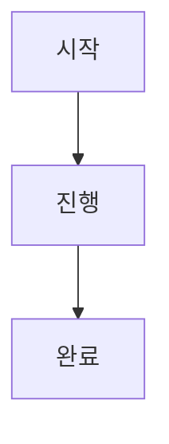
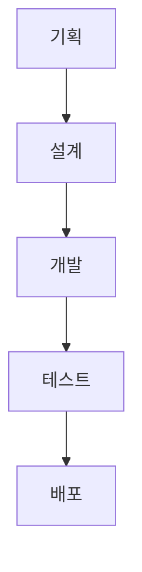
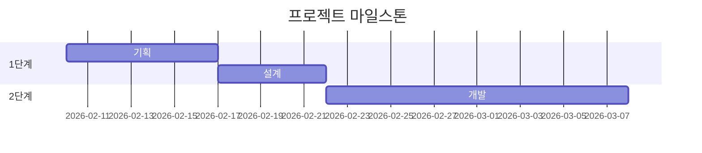
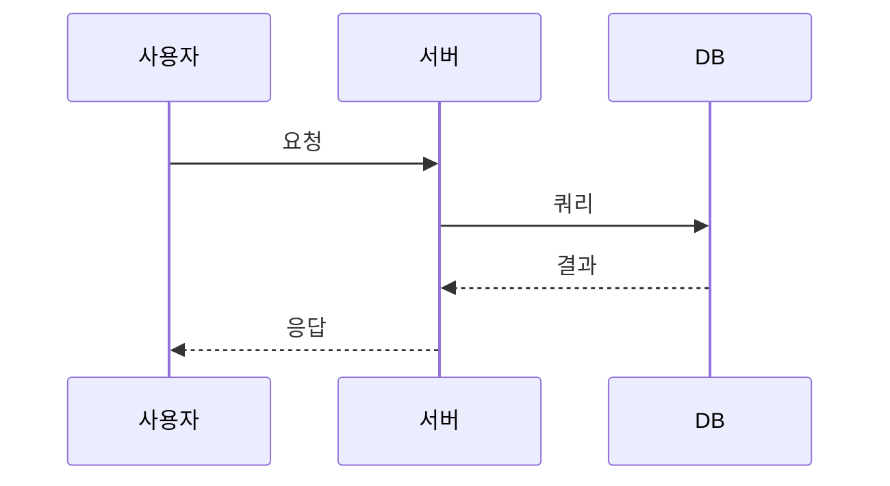

# 프로젝트 문서 운영 규약

이 저장소는 **Docusaurus 기반의 프로젝트 문서 시스템**입니다.\
계획 → 실행 → 결과 → 회고 흐름을 명확히 기록하고,\
시간 순서와 의사결정 맥락을 쉽게 추적할 수 있도록 설계되어 있습니다.

Claude는 이 저장소의 문서를 생성/수정할 때 아래 규칙을 반드시 준수해야
합니다.

------------------------------------------------------------------------

## 1. 핵심 목적

-   프로젝트의 모든 계획, 실행, 의사결정, 회고를 문서로 남긴다.
-   시간 흐름과 생성 순서를 사이드바에서 바로 파악할 수 있게 한다.
-   Draft → Approved 워크플로우를 명확히 유지한다.
-   문서는 짧고 명확하며, 서로 연결(link)되도록 작성한다.

------------------------------------------------------------------------

## 2. 문서 구조

모든 문서는 `docs/` 아래에서 다음 구조를 따른다.

    docs/
      00-meta/
        개요, 규칙, 템플릿
      10-plan/
        drafts/        # 초안 계획
        approved/      # 승인된 계획
      20-execution/
        logs/          # 실행 로그
        decisions/     # 의사결정 기록(ADR)
        meetings/      # 회의록
      30-deliverables/ # 산출물 정의/정리
      40-retros/       # 회고
      90-reference/    # 참고자료/리서치/용어집

**정렬 방식:**
-   각 카테고리 내 문서는 **파일명/디렉토리명 알파벳 오름차순**으로 자동 정렬
-   `YYYY-MM-DD-NNN` 형식으로 인해 자동으로 **시간순 정렬**
-   `position` 또는 `sidebar_position` 필드는 사용하지 않음 (알파벳순 자동 정렬)

------------------------------------------------------------------------

## 3. 프런트매터 필수 규칙

모든 문서는 아래 필드를 반드시 포함해야 한다.

``` yaml
---
title: "문서 제목"
sidebar_label: "[YYYY/MM/DD-NNN] 짧은 제목"
slug: url-friendly-slug  # 파일명에 한글/공백/특수문자 포함 시 필수
tags:
  - plan | execution | decision | meeting | deliverable | retro | reference
draft: true | false
---
```

### slug 규칙

파일명에 **한글, 공백, 특수문자**가 포함된 경우 반드시 `slug` 필드를 추가해야 한다.

**slug가 필요한 경우:**
-   한글 파일명: `시니어 생애사 분석.md`
-   공백 포함: `Interview Analysis Report.md`
-   특수문자 포함: `프롬프트 검증 가이드 (v3.1).md`

**slug 명명 규칙:**
-   영문 소문자만 사용
-   단어는 하이픈(`-`)으로 연결 (kebab-case)
-   특수문자 제거 또는 하이픈으로 변환
-   버전 표기: `v3.1` → `v3-1`

**예시:**

| 파일명 | slug |
|--------|------|
| `시니어 생애사 데이터 분석.md` | `senior-life-story-data-analysis` |
| `AI 검증 가이드 (v3.1).md` | `ai-validation-guide-v3-1` |
| `Interview Analysis.md` | `interview-analysis` |

**참고:**
-   `sidebar_position`은 사용하지 않음
-   파일명 알파벳순으로 자동 정렬되므로 별도 설정 불필요

### sidebar_label 규칙 (매우 중요)

형식:

    [YYYY/MM/DD-NNN] 제목

예시:

    [2026/02/10-001] ELLO Care 초기 기획

**순번(NNN) 규칙:**
-   NNN은 **각 카테고리 내에서** 해당 날짜 기준 001부터 시작하는 순번
-   예: `90-reference` 카테고리에서 2026/02/10에 생성된 첫 번째 문서는 001, 두 번째는 002
-   예: `10-plan` 카테고리에서 2026/02/10에 생성된 첫 번째 문서는 001 (다른 카테고리와 독립적)
-   **카테고리 구분**: 최상위 디렉토리 기준 (`00-meta`, `10-plan`, `20-execution`, `30-deliverables`, `40-retros`, `90-reference`)
-   절대 형식을 변경하거나 생략하지 말 것

------------------------------------------------------------------------

### 디렉토리 명명 및 레이블 규칙

하위 디렉토리(예: `90-reference` 아래의 서브 디렉토리)도 파일과 동일한 날짜 형식을 사용한다.

**디렉토리명 형식:**

    YYYY-MM-DD-NNN-kebab-name/

**예시:**

    90-reference/
      2026-02-10-001-onboarding-references.md
      2026-02-10-002-issue-263-attachments/

**_category_.json 예시:**

``` json
{
  "label": "[2026/02/10-002] Issue #263 Attachments",
  "link": {
    "type": "generated-index",
    "description": "카테고리 설명"
  }
}
```

**규칙:**
-   **디렉토리명도 `YYYY-MM-DD-NNN-kebab-name` 형식 사용**
-   디렉토리의 `_category_.json` 파일에서 `label` 필드에 `[YYYY/MM/DD-NNN]` 형식 사용
-   **순번은 상위 카테고리 내에서 해당 날짜 기준으로 증가**
-   예: `90-reference` 카테고리에서 2026/02/10에 첫 번째 문서가 001이면, 같은 날짜의 첫 번째 하위 디렉토리는 002
-   파일과 디렉토리는 같은 순번 체계를 공유하여 **알파벳순으로 함께 정렬**됨
-   `position` 필드는 사용하지 않음 (디렉토리명 알파벳순으로 자동 정렬)
-   최상위 구조 디렉토리(`00-meta`, `10-plan` 등)는 날짜 형식 불필요

------------------------------------------------------------------------

## 4. 파일명 규칙

파일명은 다음 형식을 따른다.

    YYYY-MM-DD-NNN-kebab-title.md

예시:

    90-reference/2026-02-10-001-project-links.md
    90-reference/2026-02-10-002-technical-docs.md
    10-plan/drafts/2026-02-10-001-initial-plan.md

규칙:

-   날짜는 파일명에서 `YYYY-MM-DD`
-   순번은 항상 3자리 (`001`, `002`, `003`...)
-   **순번은 각 카테고리 내에서 해당 날짜 기준으로 증가**
-   소문자 kebab-case 사용

### 파일 및 디렉토리 정렬 규칙

-   **사이드바는 파일명/디렉토리명 알파벳 오름차순으로 자동 정렬**
-   `YYYY-MM-DD-NNN` 형식으로 인해 자동으로 **날짜순 → 순번순** 정렬
-   파일과 디렉토리가 함께 시간순으로 정렬됨
-   `position` 또는 `sidebar_position` 필드는 사용하지 않음
-   예시:
    ```
    2026-02-09-001-kickoff.md
    2026-02-10-001-planning.md
    2026-02-10-002-technical-docs/
    2026-02-10-003-design.md
    2026-02-11-001-development.md
    ```

**중요:**
-   파일명/디렉토리명 형식만 올바르게 지키면 자동으로 시간순 정렬됨
-   별도의 position 설정 불필요

------------------------------------------------------------------------

## 5. Mermaid 다이어그램

Docusaurus의 `@docusaurus/theme-mermaid`를 통해 Mermaid 다이어그램을 지원한다.

### 5.0.1 설정 요구사항

프로젝트 초기화 시 아래 설정이 반드시 포함되어야 한다.

**패키지 설치:**

```bash
npm install --save @docusaurus/theme-mermaid
```

**docusaurus.config.ts 설정:**

```typescript
export default {
  markdown: {
    mermaid: true,
  },
  themes: ['@docusaurus/theme-mermaid'],
};
```

### 5.0.2 사용법

마크다운 파일에서 코드 블록의 언어를 `mermaid`로 지정하면 자동으로 다이어그램이 렌더링된다.

````markdown

````

### 5.0.3 권장 다이어그램 유형

| 문서 유형 | 권장 다이어그램 | 용도 |
|-----------|----------------|------|
| 계획 (Plan) | `graph TD` / `gantt` | 작업 흐름, 마일스톤 일정 |
| 의사결정 (ADR) | `graph TD` / `graph LR` | 대안 비교, 의존관계 |
| 실행 로그 | `sequenceDiagram` | 시스템 간 상호작용 |
| 회고 (Retro) | `graph TD` | 원인 분석, 개선 흐름 |
| 참고자료 | `classDiagram` / `erDiagram` | 데이터 모델, 아키텍처 |

### 5.0.4 작성 규칙

-   다이어그램은 **문서 내용을 보조**하는 용도로만 사용한다 (다이어그램만으로 문서를 구성하지 않는다)
-   노드 텍스트는 **짧고 명확하게** 작성한다
-   한글 텍스트 사용 시 대괄호로 감싼다: `A[한글 텍스트]`
-   하나의 다이어그램에 노드가 **15개를 초과하면 분리**를 검토한다
-   다이어그램 바로 위에 설명 문장을 추가하여 맥락을 제공한다

### 5.0.5 자주 쓰는 예시

**작업 흐름 (Flowchart):**

````markdown

````

**일정 (Gantt):**

````markdown

````

**시퀀스 다이어그램:**

````markdown

````

------------------------------------------------------------------------

## 6. 문서 유형별 작성 규칙

### 6.1 계획 문서 (Plan)

필수 섹션:

    ## 배경 / 문제 정의
    ## 목표 (측정 가능해야 함)
    ## 비목표 (Non-goals)
    ## 범위 (Scope)
    ## 마일스톤
    ## 리스크 및 대응
    ## 미해결 이슈
    ## 관련 문서 링크

------------------------------------------------------------------------

### 6.2 실행 로그 (Execution Log)

필수 섹션:

    ## 기간 또는 날짜
    ## 진행 내용
    ## 계획 대비 상태
    ## 블로커 / 이슈
    ## 다음 액션 (담당자 + 기한)

------------------------------------------------------------------------

### 6.3 의사결정 문서 (Decision / ADR)

필수 섹션:

    ## 배경 (Context)
    ## 결정 사항 (Decision)
    ## 고려한 대안 (Alternatives)
    ## 영향 및 결과 (Consequences)
    ## 후속 작업 (Follow-ups)

------------------------------------------------------------------------

### 6.4 회의록 (Meeting Notes)

필수 섹션:

    ## 참석자
    ## 안건
    ## 논의 내용
    ## 결정 사항
    ## 액션 아이템 (담당자 + 기한)

------------------------------------------------------------------------

## 7. Draft → Approved 워크플로우

### Draft 상태

-   위치: `10-plan/drafts/`
-   반드시 `draft: true`

### 승인 시 처리 절차

1.  문서를 `10-plan/approved/`로 이동
2.  `draft: false`로 변경
3.  필요 시 `approved` 태그 추가
4.  실행 문서에서 해당 계획 문서를 링크

주의: - 승인되어도 **sidebar의 날짜 태그는 절대 변경하지 않는다**

------------------------------------------------------------------------

## 8. 문서 작성 원칙

### 기본 스타일

-   문서 상단에 3\~6줄 요약 작성
-   긴 문장은 피하고, 불릿 중심 작성
-   섹션 구조를 항상 유지

### 액션 아이템 규칙

모든 액션은 다음 형식:

    - [ ] 작업 내용 — 담당자 @이름 — 기한 YYYY-MM-DD

------------------------------------------------------------------------

## 9. 문서 간 링크 규칙

-   다른 문서를 참조할 때는 반드시 링크 사용
-   의사결정이 있으면 해당 Decision 문서를 링크
-   중복 내용 작성 금지
-   공통 내용은 reference 문서로 분리 후 링크

------------------------------------------------------------------------

## 10. 금지 사항

Claude는 아래 행동을 해서는 안 된다.

-   날짜 또는 순번을 임의로 생성
-   sidebar_label 형식 변경
-   동일 내용을 여러 문서에 중복 작성
-   Draft 문서를 승인 폴더로 이동하면서 `draft: true` 유지

------------------------------------------------------------------------

## 11. 문서 생성 시 기본 체크리스트

새 문서를 만들 때 반드시 확인:

-   [ ] 올바른 폴더에 생성했는가
-   [ ] 파일명이 규칙을 따르는가
-   [ ] sidebar_label 형식이 맞는가
-   [ ] 파일명에 한글/공백/특수문자가 있으면 `slug` 추가했는가
-   [ ] tags가 최소 1개 이상 있는가
-   [ ] draft 상태가 맞는가
-   [ ] 필수 섹션이 모두 포함되었는가
